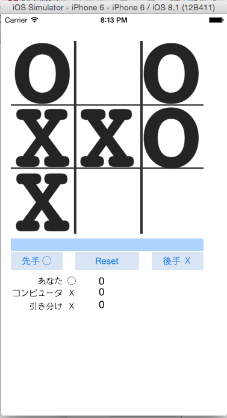

# swift-tictactoe

screnncast https://www.youtube.com/watch?v=LkYpoRj-7hA を見ながら作成したマルバツゲームです。

# 概要
人間とコンピュータの対戦です。  

先手X　　　人間が先手を打つます。  
Reset　　　ゲームをリセットします。(盤面をクリアします)  
後手◯　　　コンピュータが先手を打ちます。  

対戦成績  
　　あなた　　　　人間の勝ちの回数。  
　　コンピュータ　コンピュータの勝ちの回数。  
　　引き分け　　　引き分けの回数  

undo　　打ち手を戻します。  

コンピュータの思考ルーチン  
　　ランダム　　開いているマスにランダムに打ちます。  
　　蹄跡　　　　定石をピログラムコードで作成してあり、それに従って打ちます。  
　　MinMax　　ミニマックス法で打ち手を評価して、最善手を選んで打ちます。  

# TODO
- テストコードを書くこと。
- 画面のデザイン。
